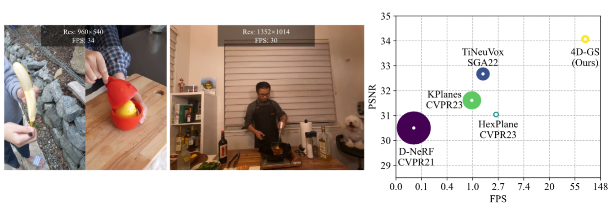

# 4D Gaussian Splatting for Real-Time Dynamic Scene Rendering

## CVPR 2024

### [Project Page](https://guanjunwu.github.io/4dgs/index.html)| [arXiv Paper](https://arxiv.org/abs/2310.08528)

[Guanjun Wu](https://guanjunwu.github.io/) <sup>1*</sup>, [Taoran Yi](https://github.com/taoranyi) <sup>2*</sup>,
[Jiemin Fang](https://jaminfong.cn/) <sup>3‡</sup>, [Lingxi Xie](http://lingxixie.com/) <sup>3 </sup>, </br>[Xiaopeng Zhang](https://scholar.google.com/citations?user=Ud6aBAcAAAAJ&hl=zh-CN) <sup>3 </sup>, [Wei Wei](https://www.eric-weiwei.com/) <sup>1 </sup>,[Wenyu Liu](http://eic.hust.edu.cn/professor/liuwenyu/) <sup>2 </sup>, [Qi Tian](https://www.qitian1987.com/) <sup>3 </sup> , [Xinggang Wang](https://xwcv.github.io) <sup>2‡✉</sup>

<sup>1 </sup>School of CS, HUST &emsp; <sup>2 </sup>School of EIC, HUST &emsp; <sup>3 </sup>Huawei Inc. &emsp;

<sup>\*</sup> Equal Contributions. <sup>$\ddagger$</sup> Project Lead. <sup>✉</sup> Corresponding Author.

---


Our method converges very quickly and achieves real-time rendering speed.


## Environmental Setups

Please follow the [3D-GS](https://github.com/graphdeco-inria/gaussian-splatting) to install the relative packages.

```bash
git clone https://github.com/hustvl/4DGaussians
cd 4DGaussians
git submodule update --init --recursive
conda create -n Gaussians4D python=3.7 
conda activate Gaussians4D

pip install -r requirements.txt
pip install -e submodules/depth-diff-gaussian-rasterization
pip install -e submodules/simple-knn
```

In our environment, we use pytorch=1.13.1+cu116.

## Data Preparation


**For multipleviews scenes:**
If you want to train your own dataset of multipleviews scenes,you can orginize your dataset as follows:

```
├── data
|   | multipleview
│     | (your dataset name) 
│   	  | cam01
|     		  ├── frame_00001.jpg
│     		  ├── frame_00002.jpg
│     		  ├── ...
│   	  | cam02
│     		  ├── frame_00001.jpg
│     		  ├── frame_00002.jpg
│     		  ├── ...
│   	  | ...
```
After that,you can use the  `multipleviewprogress.sh` we provided to generate related data of poses and pointcloud.You can use it as follows:
```bash
bash multipleviewprogress.sh (youe dataset name)
```
You need to ensure that the data folder is orginized as follows after running multipleviewprogress.sh:
```
├── data
|   | multipleview
│     | (your dataset name) 
│   	  | cam01
|     		  ├── frame_00001.jpg
│     		  ├── frame_00002.jpg
│     		  ├── ...
│   	  | cam02
│     		  ├── frame_00001.jpg
│     		  ├── frame_00002.jpg
│     		  ├── ...
│   	  | ...
│   	  | sparse_
│     		  ├── cameras.bin
│     		  ├── images.bin
│     		  ├── ...
│   	  | points3D_multipleview.ply
│   	  | poses_bounds_multipleview.npy
```


## Training

For training multipleviews scenes,you are supposed to build a configuration file named (you dataset name).py under "./arguments/mutipleview",after that,run
```python
python train.py -s  data/multipleview/(your dataset name) --port 6017 --expname "multipleview/(your dataset name)" --configs arguments/multipleview/(you dataset name).py 
```


For your custom datasets, install nerfstudio and follow their [COLMAP](https://colmap.github.io/) pipeline. You should install COLMAP at first, then:

```python
pip install nerfstudio
# computing camera poses by colmap pipeline
ns-process-data images --data data/your-data --output-dir data/your-ns-data
cp -r data/your-ns-data/images data/your-ns-data/colmap/images
python train.py -s data/your-ns-data/colmap --port 6017 --expname "custom" --configs arguments/hypernerf/default.py 
```
You can customize your training config through the config files.

## Checkpoint

Also, you can training your model with checkpoint.

```python
python train.py -s data/dnerf/bouncingballs --port 6017 --expname "dnerf/bouncingballs" --configs arguments/dnerf/bouncingballs.py --checkpoint_iterations 200 # change it.
```

Then load checkpoint with:

```python
python train.py -s data/dnerf/bouncingballs --port 6017 --expname "dnerf/bouncingballs" --configs arguments/dnerf/bouncingballs.py --start_checkpoint "output/dnerf/bouncingballs/chkpnt_coarse_200.pth"
# finestage: --start_checkpoint "output/dnerf/bouncingballs/chkpnt_fine_200.pth"
```

## Rendering

Run the following script to render the images.

```
python render.py --model_path "output/dnerf/bouncingballs/"  --skip_train --configs arguments/dnerf/bouncingballs.py  &
```

## Evaluation

You can just run the following script to evaluate the model.

```
python metrics.py --model_path "output/dnerf/bouncingballs/" 
```


`colmap.sh`:
generate point clouds from input data

```bash
bash colmap.sh data/hypernerf/virg/vrig-chicken hypernerf 
bash colmap.sh data/dynerf/sear_steak llff
```
If you wish to run the baseline 3DGS, please set the enable_smooth_torch=False at the train.py and uncomment the relevant section just before the "if use_smooth_torch" statement. This will produce the default 3DGS without the depth supervision.
Please note that in the context of this MSc research project, we trained only at the "coarse" level for 30,000 iterations thus disbaling the dynamic components of 4DGS. This essentially means that we reduced 4DGS to 3DGS. Please also note that in order to reproduce our results, you will need to disable the SSIM loss compoenent.


